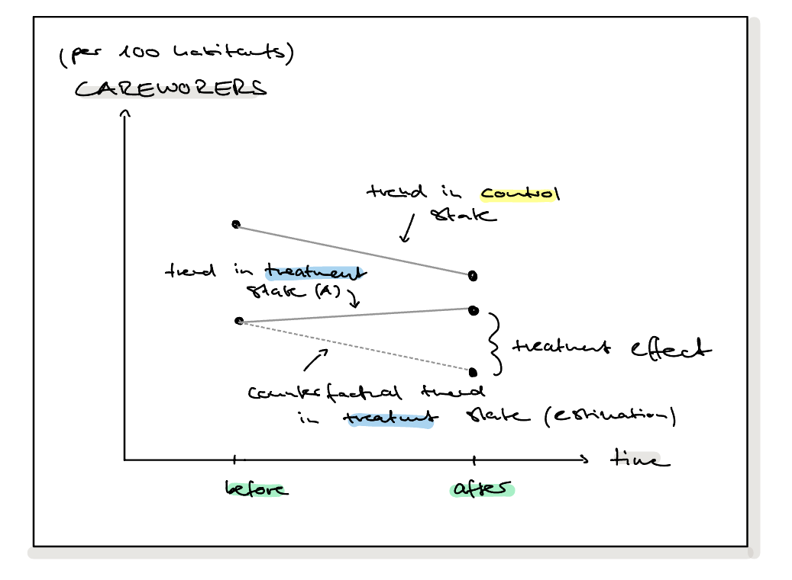

# Part 0

We import the dataset with `sep=";"` and use`skim(df)` to get a first overview of our data. Then, we process the usual cleaning steps.

```{r setup, include=FALSE}

# Load required packages
library(skimr)
library(ggplot2)
library(sandwich)
library(lmtest)

```

```{r read csv, include=TRUE}
# Load the data set
df <- read.csv("careworkers_did.csv", sep=";")

```

```{r data cleaning, include=TRUE, results='hide'}
# Summarize the data
skim(df)

# Replace invalid values with NA
df$CAREWORKERS[df$CAREWORKERS == -9999999] <- NA
df$YIAR[df$YIAR == -1] <- NA

# Shorten country names
df$COUNTRY <- gsub("Country ", "", df$COUNTRY)

# Rename column
names(df)[names(df) == "YIAR"] <- "YEAR"

# Summarize cleaned data
skim(df)
```

# Part I

**1. Generating two dummy variables for difference-in-differences estimation**

```{r dummy variables, include=TRUE, results='hide'}

# Create POST dummy
df$POST <- ifelse(df$YEAR > 1992, 1, 0)

# Create TREATED dummy
df$TREATED <- ifelse(df$COUNTRY == "A", 1, 0)

```

**2. Key assumption of difference-in-differences estimation**

The key assumption of the difference-in-differences estimation is that treatment and control groups would have evolved in parallel in the absence of treatment.

**3. Visual evidence of key assumption**

First, we created a sketch of the difference-in-differences (DiD) framework discussed in the lecture in order to illustrate the intuition behind the parallel trends assumption and the treatment effect.



Next, we assess whether the key assumption underlying the DiD approach, the parallel trends assumption, appears to hold in our data. In particular, we examine whether the two countries followed similar trends *before* the reform was implemented in 1993. The graph below suggests that this assumption is reasonably satisfied.

```{r visual, include=TRUE, results='hide', warning=FALSE}

avg_df <- aggregate(CAREWORKERS ~ YEAR + COUNTRY,
                    data = df,
                    mean)

ggplot(avg_df,
       aes(x = YEAR,
           y = CAREWORKERS,
           color = COUNTRY)) +
  geom_line(size = 1.2) +
  geom_vline(xintercept = 1993,
             linetype = "dashed") +
  labs(title = "Countries A and B Exhibit Parallel Trends Before 1993",
       y = "Careworkers per 100 inhabitants")


```
<br>

**4. Formal evidence with regression**

To formally assess the plausibility of the parallel trends assumption, we conduct a placebo reform test using only *pre-treatment* observations. Specifically, we artificially assign the reform to 1992 and estimate a standard DiD specification.

$$
CAREWORKERS_{it} = \alpha + \beta_1 PLACEBO\_POST_t + \beta_2 TREATED_i + \beta_3 (PLACEBO\_POST_t \times TREATED_i) + \varepsilon_{it}
$$

```{r DiD regression, include=TRUE, warning=FALSE}

# Placebo reform test using only pre-treatment data

pre_df <- subset(df, YEAR < 1993)

# Artificial placebo reform in 1992
pre_df$PLACEBO_POST <- ifelse(pre_df$YEAR >= 1992, 1, 0)

placebo_model <- lm(
  CAREWORKERS ~ TREATED * PLACEBO_POST,
  data = pre_df
)

summary(placebo_model)

```
The interaction term between `TREATED` and `PLACEBO_POST` is not statistically significant `(p = 0.313)`, suggesting that there is no evidence of differential pre-treatment trends between the treatment and control groups. This provides supportive evidence for the parallel trends assumption.

**5. Plausibility of the key assumption **

Based on both the visual inspection and the placebo regression, the parallel trends assumption appears plausible, however, the placebo test provides only supportive evidence, not a formal proof.

**6. Potential concern in structure of data **

A potential concern in the data structure is that observations are clustered within towns (panel data), so standard errors should be clustered at the town level to account for within-group serial correlation.


# Part II

**1. Estimation of the DiD regression model**

```{r, include=TRUE, warning=FALSE}
#Estimation
did_model <- lm(CAREWORKERS ~ POST + TREATED + POST * TREATED, data = df)

# Clustered standard errors on town level
coeftest(did_model, vcov = vcovCL(did_model, cluster = ~ID))

```

**2. Main coefficient of interest**

The main coefficient of interest is $\beta_3$ (the coefficient on the interaction term `POST × TREATED`), because it represents the difference-in-differences (DiD) estimator and can be interpreted as the causal effect of the reform on the treated country (Country A), relative to the control country, under the parallel trends assumption.

**3. Interpretation of $\hat\beta_3$**

$\hat\beta_3$ measures the average change in the number of careworkers per 100 inhabitants in Country A after the reform, relative to the counterfactual trend captured by Country B which is the causal treatment effect of the tax exemption reform.

**4. Interpretation of the other coefficients**

```{r echo=FALSE, message=FALSE, warning=FALSE}
library(knitr)

# Create the data frame
coef_table <- data.frame(
  Coefficient = c(
    "$\\hat{\\beta}_0$", 
    "$\\hat{\\beta}_1$ (POST)", 
    "$\\hat{\\beta}_2$ (TREATED)"
  ),
  Interpretation = c(
    "The average number of careworkers per 100 inhabitants in Country B before the reform.",
    "The average change in careworkers after 1992 for Country B (the control group), capturing the common time trend.",
    "The average difference in careworkers between Country A and Country B before the reform, capturing pre-existing baseline differences."
  )
)

# Render the table
kable(coef_table, escape = FALSE)
``` 

**5. Was the reform successful?**

Yes, the reform was successful: the coefficient on the interaction term $\hat{\beta}_3 = 0.728$ (`POST:TREATED`) is positive and highly statistically significant ($t = 10.550$, $p < 2 \times 10^{-16}$), indicating that the tax exemption reform increased the number of careworkers per 100 inhabitants in Country A by approximately 0.73 additional careworkers relative to the change observed in Country B.